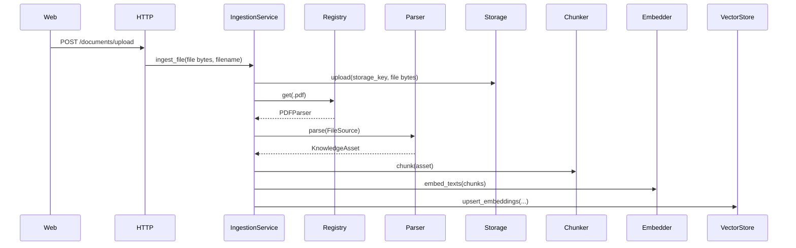
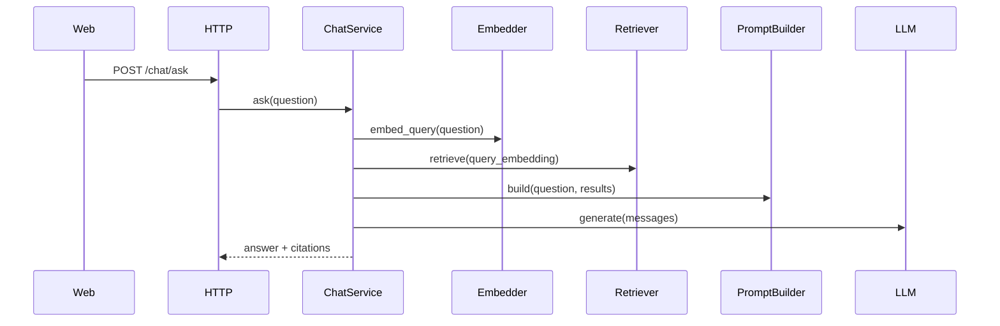

# Architecture

This MVP is a backend-first AI Knowledge Base for uploading PDFs to Filebase object storage, parsing them into `KnowledgeAsset` domain objects, chunking, embedding, storing vectors in PostgreSQL/pgvector, and chatting with citation-backed answers.

## Backend Structure

```text
apps/api/src/
├── http/
│   ├── routes/          # FastAPI handlers only
│   ├── schemas/         # Pydantic API DTOs
│   └── dependencies/    # FastAPI Depends wiring
├── domain/
│   ├── entities/        # KnowledgeBase, KnowledgeAsset, Chunk, source metadata
│   ├── interfaces/      # Parser, repo, embedder, LLM, vector store ports
│   └── value_objects/
├── application/
│   ├── ingestion/       # parse -> chunk -> embed -> store use case
│   ├── chat/            # retrieval + prompt + LLM use case
│   └── knowledge_base/  # KB use cases
├── ingestion/
│   ├── pipeline.py
│   ├── registry.py      # extension -> parser
│   ├── sources/         # FileSource for MVP uploads
│   └── parsers/         # PDFParser for MVP
├── processing/
│   └── chunking/        # chunker implementation + strategies
├── retrieval/           # query-time retrieval orchestration
├── infrastructure/
│   ├── database/        # SQLAlchemy models/session
│   ├── repositories/    # Postgres repositories
│   ├── vector_store/    # pgvector adapter
│   ├── storage/         # Filebase S3-compatible adapter
│   ├── langchain_adapters/
│   └── ai_providers/    # AICredits providers
└── core/                # config, logging, exceptions, constants
```

## Flow





## Boundaries

- `http` owns HTTP concerns only.
- `domain` has no FastAPI, SQLAlchemy, or LangChain imports.
- `application` orchestrates use cases and depends on domain ports.
- `ingestion` normalizes raw sources into domain assets.
- `processing` operates on parsed assets and is source-agnostic.
- `retrieval` owns query-time search orchestration.
- `infrastructure` implements external concerns: DB, pgvector, LangChain wrappers, and AICredits.

LangChain imports are only allowed in:

```text
apps/api/src/infrastructure/langchain_adapters/
```

Verification:

```bash
grep -r "import langchain" apps/api/src/
```

## API

- `GET /health`
- `GET /documents`
- `POST /documents/upload`
- `PATCH /documents/{asset_id}`
- `DELETE /documents/{asset_id}`
- `GET /knowledge-bases/default`
- `POST /chat/ask`

## Data Model

- `KnowledgeBase`: default container, with nullable `owner_id` for later auth.
- `KnowledgeAsset`: immutable source version with `lineage_id`, `version`, status, failure step, metadata, and supersession state.
- `Chunk`: text fragment tied to a specific asset version.
- `Embedding`: vector tied to a chunk, with model, dimensions, and created timestamp.
