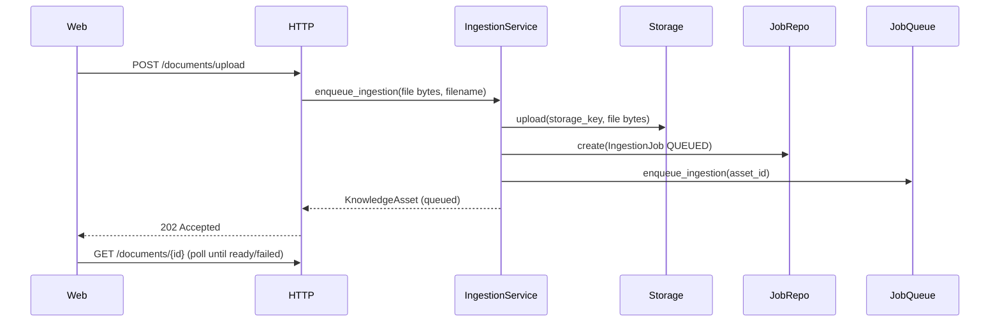
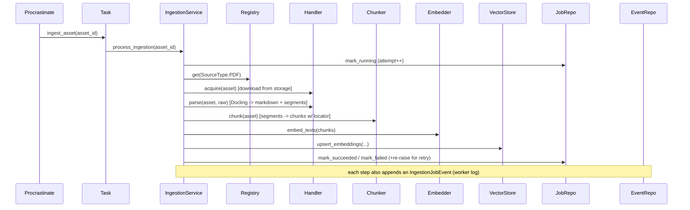
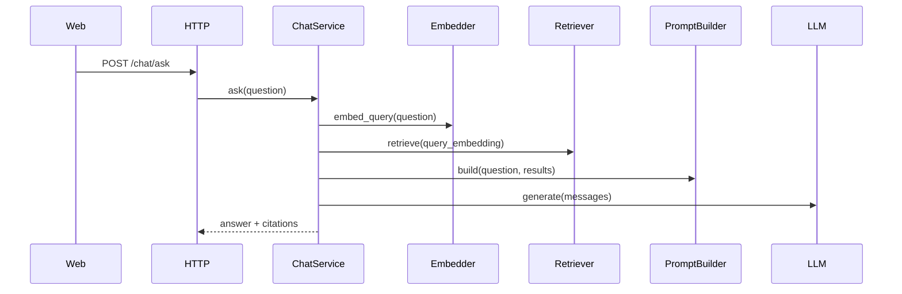

# Architecture

This MVP is a backend-first AI Knowledge Base for uploading PDFs to Filebase object storage, converting them to Docling Markdown-backed `KnowledgeAsset` domain objects, chunking, embedding, storing vectors in PostgreSQL/pgvector, and chatting with citation-backed answers.

Ingestion is **asynchronous**. The upload request only stores the file and enqueues a job; a separate **worker** runs the acquire → parse → chunk → embed pipeline. The queue is Postgres-backed (Procrastinate), so no extra infrastructure is required, and it sits behind the `IJobQueue` port so the engine stays swappable.

Ingestion is also **source-agnostic**. Everything source-specific (how to fetch raw content and how to parse it) lives behind a single `ISourceHandler` port, one per `SourceType`, resolved through a `SourceHandlerRegistry`. Only PDF is implemented today; websites/YouTube are added later as new handlers without touching the service, chunker, embedder, or chat. Handlers emit source-neutral **segments** (each with a typed `locator` — a page number for PDF, a timestamp for a future video source), so chunking and citations never special-case a source.

The worker keeps a **persisted event log**: each pipeline transition/terminal state writes an `IngestionJobEvent` row (distinct from stdout structlog output), which the `/jobs` dashboard reads.

## Backend Structure

```text
apps/api/src/
├── composition.py       # composition root: builds the object graph for HTTP + worker
├── http/
│   ├── routes/          # FastAPI handlers only
│   ├── schemas/         # Pydantic API DTOs
│   └── dependencies/    # thin FastAPI Depends wrappers over composition.py
├── domain/
│   ├── entities/        # KnowledgeBase, KnowledgeAsset, Chunk, IngestionJob, JobEvent, RawContent, SourceType
│   ├── interfaces/      # ISourceHandler, repo, embedder, LLM, vector store, job queue ports
│   └── value_objects/
├── application/
│   ├── ingestion/       # enqueue (request) + process (worker) use cases
│   ├── chat/            # retrieval + prompt + LLM use case
│   └── knowledge_base/  # KB use cases
├── ingestion/
│   ├── source_types.py  # edge resolver: filename/extension -> SourceType
│   ├── registry.py      # SourceHandlerRegistry: SourceType -> handler
│   └── handlers/        # PdfSourceHandler (acquire + parse) for MVP
├── processing/
│   └── chunking/        # chunker implementation + strategies
├── retrieval/           # query-time retrieval orchestration
├── infrastructure/
│   ├── database/        # SQLAlchemy models/session (get_db + session_scope)
│   ├── repositories/    # Postgres repositories (incl. ingestion jobs)
│   ├── queue/           # Procrastinate app, task, and IJobQueue adapter
│   ├── vector_store/    # pgvector adapter
│   ├── storage/         # Filebase S3-compatible adapter (upload/download)
│   ├── document_parsing/ # Docling-backed parser adapters
│   ├── langchain_adapters/
│   └── ai_providers/    # AICredits providers
└── core/                # config, logging, exceptions, constants
```

## Flow

Enqueue (fast, in the request):



Process (slow, in the worker):





## Boundaries

- `http` owns HTTP concerns only.
- `domain` has no FastAPI, SQLAlchemy, LangChain, or Procrastinate imports.
- `application` orchestrates use cases and depends on domain ports (including `IJobQueue` and `ISourceHandler`).
- `composition.py` is the only module that knows every concrete adapter (including which handler serves each `SourceType`); HTTP and the worker both build services through it.
- `ingestion` normalizes raw sources into domain assets: `source_types` resolves the `SourceType`, the registry maps it to an `ISourceHandler`, and each handler owns acquisition + parsing for its source.
- `processing` operates on parsed assets and is source-agnostic (it consumes `segments`/`locator`, never a source-specific field like a page number).
- `retrieval` owns query-time search orchestration.
- `infrastructure` implements external concerns: DB, pgvector, object storage, the Procrastinate queue, LangChain wrappers, and AICredits.

The queue engine is confined to `infrastructure/queue/`. Verify:

```bash
grep -r "procrastinate" apps/api/src/domain/ apps/api/src/application/
```

LangChain imports are only allowed in:

```text
apps/api/src/infrastructure/langchain_adapters/
```

Verification:

```bash
grep -r "import langchain" apps/api/src/
```

## API

- `GET /health`
- `GET /documents`
- `GET /documents/{asset_id}` — single asset + latest job (status polling)
- `GET /documents/{asset_id}/events` — persisted worker-log trail for the asset
- `POST /documents/upload` — enqueues; returns `202` with a `queued` asset
- `POST /documents/{asset_id}/retry` — re-enqueues a failed asset (`202`)
- `PATCH /documents/{asset_id}`
- `DELETE /documents/{asset_id}`
- `GET /jobs` — recent ingestion jobs for the worker-activity dashboard
- `GET /knowledge-bases/default`
- `POST /chat/ask`

## Data Model

- `KnowledgeBase`: default container, with nullable `owner_id` for later auth.
- `KnowledgeAsset`: immutable source version with `lineage_id`, `version`, status (now including `queued`), failure step, metadata, and supersession state. Tracks the **pipeline stage**.
- `IngestionJob`: the unit of work and its **retry accounting** (status, attempts, `max_attempts`, `last_error`, timings) for one asset. Domain-owned and queue-engine-agnostic; distinct from Procrastinate's internal tables.
- `IngestionJobEvent`: append-only **worker log** — one row per pipeline transition/terminal state (event name, level, message, `data`, timestamp), keyed by asset (and job when known). The durable, queryable counterpart to stdout logs; powers the `/jobs` dashboard.
- `Chunk`: text fragment tied to a specific asset version, carrying a source-neutral `locator` (e.g. `{"type": "page", "value": 3}`) in its metadata.
- `Embedding`: vector tied to a chunk, with model, dimensions, and created timestamp.
